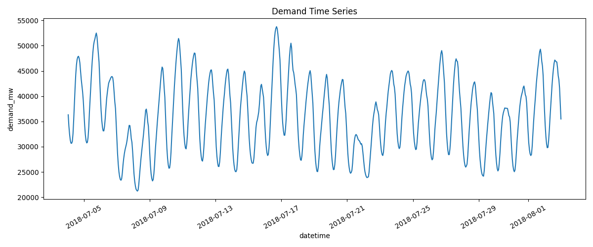
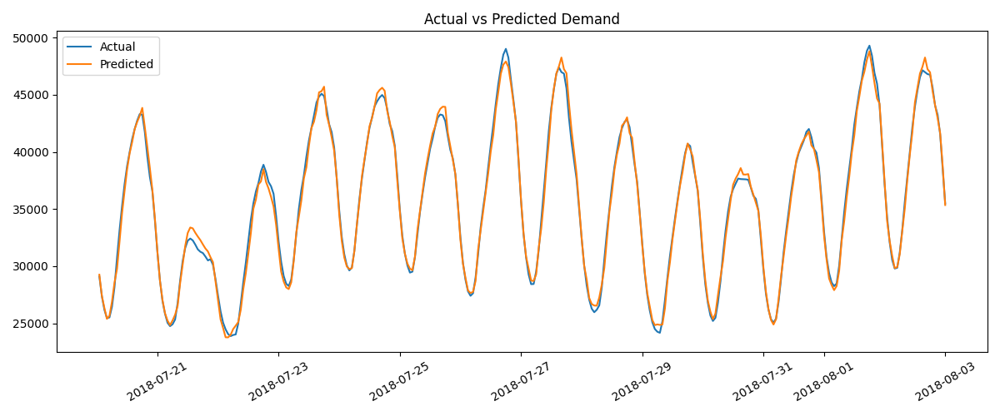
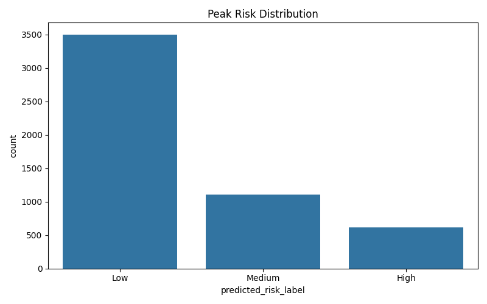

# Energy Intelligence Platform

Energy analytics and forecasting platform combining data visualization, machine learning, and strategic insights for complex energy systems.

## Executive Summary

This repository provides an end-to-end energy analytics workflow for electricity demand forecasting, peak-risk scoring, nuclear capacity analytics, SQL reporting, and decision-oriented dashboarding.

The project is built as a practical data science and consulting portfolio project: it turns raw or sample energy data into forecasts, risk labels, figures, reports, and an interactive Streamlit dashboard.

Live dashboard:

https://energy-intelligence-platform.streamlit.app/

## Objective

Create a reproducible platform that helps energy stakeholders explore:

- expected electricity demand patterns
- peak demand risk periods
- demand scenarios through 2030
- nuclear baseload capacity by country, region, and status
- analytical outputs that can be communicated to business users

## Problem Statement

Utilities, energy companies, consultants, and industrial operators need to forecast demand, identify operational risk periods, and communicate results clearly. Raw energy data is often time-based, noisy, and difficult to translate into decisions.

This platform demonstrates how a structured Python pipeline can move from raw demand data to forecasting, classification, scenario analysis, SQL outputs, and business-facing reporting.

## Data Sources

- PJM hourly electricity demand data, such as `PJME_hourly.csv`
- Alternative hourly demand files with timestamp and demand/load columns
- IAEA PRIS/RDS-1-style nuclear capacity sample data
- Optional energy text comments for NLP analysis

The included data supports reproducible local execution. Some datasets are samples or public historical files and should not be interpreted as live operational feeds.

## Features

- Electricity demand forecasting with statistical and machine learning models
- Peak demand risk classification
- 2030 demand scenario simulator
- Nuclear capacity analytics by country, region, and reactor status
- SQL layer with reusable business queries
- Streamlit dashboard for interactive exploration
- Offline executive report generation from structured metrics
- NLP-style text analysis for energy comments
- PySpark and Databricks ETL examples
- Tests for core data and modeling behavior

## Tech Stack

- Python
- pandas, numpy
- scikit-learn
- XGBoost
- statsmodels
- NLTK
- matplotlib, seaborn, Plotly
- Streamlit
- SQLite
- pytest
- PySpark / Databricks templates

## Project Structure

```text
energy-intelligence-platform/
├── data/                 # raw, sample, and processed datasets
├── docs/                 # architecture, model card, data dictionary, deployment notes
├── models/               # trained model artifacts
├── notebooks/            # EDA, forecasting, risk scoring, nuclear analytics, NLP
├── outputs/              # figures, metrics, reports, SQL outputs
├── spark/                # PySpark and Databricks templates
├── sql/                  # database creation and analytical queries
├── src/                  # data, features, models, reports, NLP, dashboard
├── tests/                # pytest tests
├── run_pipeline.py       # end-to-end pipeline entry point
└── README.md
```

## Methodology

The platform follows a clear analytical workflow:

1. Load and clean hourly demand and nuclear capacity data.
2. Build time-based, lag, rolling, and scenario features.
3. Train demand forecasting models and evaluate forecast error.
4. Classify peak-risk periods using percentile-based labels and supervised models.
5. Aggregate nuclear capacity by country, region, and status.
6. Generate figures, metrics, reports, and SQL outputs.
7. Serve the outputs through a Streamlit dashboard.

The 2030 demand and nuclear capacity views are scenario tools, not guaranteed forecasts. Their value is in making assumptions visible and adjustable.

## Results / Insights

Running the pipeline creates:

- demand forecast outputs
- forecast error metrics
- peak-risk labels and classification metrics
- nuclear capacity summaries
- SQL query results
- generated charts
- an executive report

Review generated artifacts in:

- `outputs/metrics/`
- `outputs/figures/`
- `outputs/reports/executive_report.md`
- `data/processed/`

The exact results depend on the demand dataset used locally.

## Screenshots

Representative generated figures:







Dashboard screenshots will be added soon.

## How to Run Locally

```bash
git clone https://github.com/gastonecisterna405/energy-intelligence-platform.git
cd energy-intelligence-platform

python -m venv .venv
source .venv/bin/activate
pip install -r requirements.txt

python run_pipeline.py
streamlit run src/dashboard/app.py
```

To download the public demand dataset used by the demo workflow:

```bash
python -m src.data.download_real_data
python run_pipeline.py
```

Run tests with:

```bash
pytest
```

## Future Improvements

- Add weather and holiday features.
- Add electricity price and fuel market data.
- Track experiments with MLflow or a similar tool.
- Add data drift and quality monitoring.
- Connect the dashboard to governed warehouse tables.
- Extend reporting with an approved enterprise LLM endpoint using environment variables.

## Professional Note

This project demonstrates applied AI and analytics for energy forecasting, operational risk scoring, and decision support in complex energy systems.
